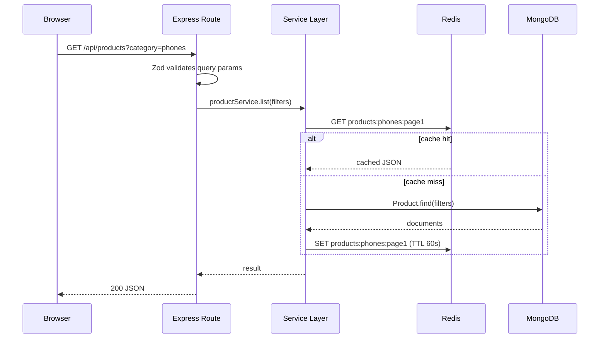
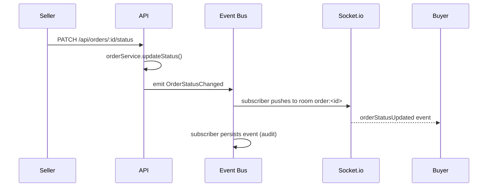
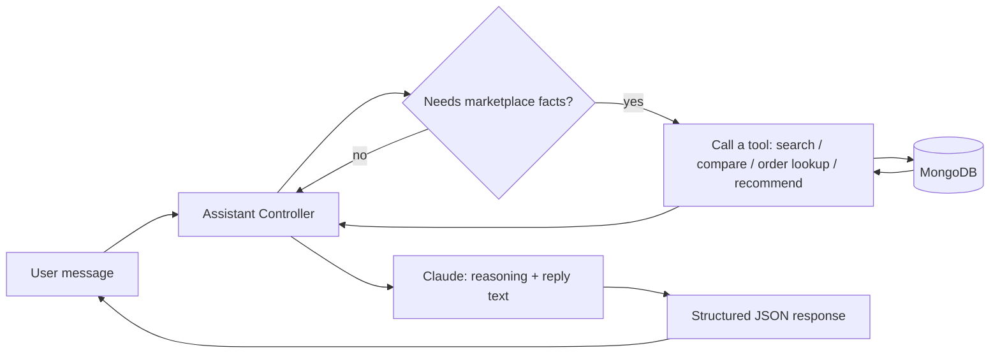
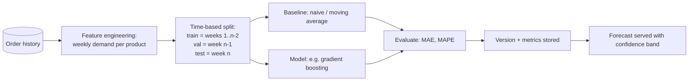

# NEXUS Target Architecture

This is a proposal, not a done deal — it maps the 12 conceptual layers from the
upgrade spec onto concrete choices, and is explicit everywhere the "obvious"
enterprise choice (Postgres, Kafka, a graph database, a hosted Prometheus/Grafana
stack) would require infrastructure this session cannot provision on your behalf
(a new database account, a new message-broker account, etc.) or would replace
something in `docs/CODEBASE_AUDIT.md` that already works.

Guiding principle from the spec itself, taken seriously: **modular monolith**,
service boundaries drawn clearly enough to extract later, no technology added
because it looks good on a slide.

---

## 0. Non-negotiable ground rule

Every "intelligence" layer below (pricing, forecasting, recommendations,
analytics, fraud) must be **honest about its data source**:

- If it's computed from real data in your database, it's real, however small.
- If there isn't enough real data yet to make a layer meaningful (e.g. demand
  forecasting needs order history spanning multiple time periods, and this
  database currently has a handful of orders), the options are: (a) ship a
  correct baseline that degrades gracefully with sparse data, or (b) generate
  clearly-labeled synthetic seed data for demo purposes — never silently, and
  never presented as real historical metrics. This is called out per-layer
  below and needs your explicit sign-off before any synthetic data gets
  generated (see §12).

---

## 1. Layer-by-layer mapping

| Spec layer | Concrete choice | New infra/account needed? |
|---|---|---|
| Web application | Existing React SPA (keep) | No |
| API layer | Existing Express app + Zod validation at route boundaries + one centralized error-handling middleware | No |
| Marketplace domain services | New `server/services/*.js` — business logic moves out of controllers (controllers become thin: parse → call service → respond) | No |
| Real-time communication | Existing Socket.io, hardened: re-join rooms on reconnect, new event types (`inventory:changed`, `seller:metrics`), optional Redis adapter if ever multi-instance | No (Redis already provisioned) |
| Cache layer | Existing Upstash Redis, fixed to actually cache (read-through on hot product list/detail queries) instead of only `flushdb()`-invalidating | No |
| Event-driven processing | In-process `EventEmitter`-based domain event bus, optionally persisted to **Redis Streams** (already provisioned) for replay/audit — not Kafka | No |
| Analytics layer | MongoDB aggregation pipelines over orders/events, computed on request (small data volume) with room to move to a scheduled materialized rollup later | No |
| ML layer | Explainable rule-based pricing (real); statistical baseline forecaster (moving average / exponential smoothing, real); optional trained regression model — see §7 | No, unless you want a Python microservice for real `scikit-learn` training (optional, see §7) |
| Recommendation engine | Content-based similarity + co-purchase (from real `Order` data) + popularity fallback, explicit candidate → rank → business-rules pipeline | No |
| AI shopping assistant | Existing Claude-backed assistant, extended with explicit tools (see §9) | No (needs `ANTHROPIC_API_KEY`, already scoped) |
| Graph intelligence | MongoDB `$graphLookup` + an in-memory adjacency computation for "similar to" / "frequently bought with" — a real graph *query pattern*, not a graph *database* | No, unless you specifically want Neo4j for the résumé line (optional, see §10) |
| Observability | Structured logging (`pino`), request-ID middleware, in-process latency/error counters exposed at `GET /metrics` in Prometheus text format | No to build it; yes (Grafana Cloud free tier, or self-hosted) if you want an actual dashboard, not just the endpoint |

---

## 2. Request flow (typical read)



## 3. Real-time flow (order status + inventory)



On reconnect, the client re-emits `joinOrder` for every order currently visible
on screen (fixes the audit's §6 finding — today this only happens once, on
initial mount).

## 4. Event flow

Every domain event follows one envelope, matching the spec's requirement:

```json
{
  "eventId": "evt_...",
  "type": "OrderCreated",
  "timestamp": "2026-09-01T10:00:00.000Z",
  "producer": "order-service",
  "correlationId": "req_...",
  "payload": { "orderId": "...", "buyerId": "...", "total": 20000 }
}
```

Events used at launch: `ProductCreated`, `ProductUpdated`, `InventoryChanged`,
`CartUpdated` (client-emitted, fire-and-forget, for analytics only — cart stays
client-authoritative), `OrderCreated`, `OrderStatusChanged`, `OrderCancelled`,
`ReviewCreated`, `UserInteractionRecorded` (view/search/click, sampled).

Consumers (in-process at first): analytics rollup, recommendation
impression/interaction logger, notification dispatcher, audit log writer.
Each consumer failure is caught and logged independently — one slow/broken
consumer must never block the request that produced the event (events are
emitted *after* the triggering write commits, not inside its transaction).

## 5. AI flow



Unchanged core rule from the current implementation: the model never states a
price, stock level, order status, or rating that didn't come from a tool
result. This is already true today (existing assistant only ever echoes
`filters` back into a real `getProducts` call); extending it with more tools
(§9) keeps the same discipline.

## 6. ML flow (forecasting, when/if built — see §7 for the honesty caveat)



---

## 7. Pricing & forecasting — the honest version

**Pricing intelligence (Phase 5):** fully buildable for real right now, no data
volume problem. A rule-based scorer over demand signal (views + recent order
velocity), inventory level, and time-based seasonality can produce an
explainable recommended price with real driver attribution today, on your
real `Product`/`Order`/event data. This ships as real, working code.

**Demand forecasting (Phase 6):** this is the layer where I want to be blunt.
Your current database has a handful of orders. A time-aware train/val/test
split and a genuine evaluation metric (MAE/MAPE) require demand history
spanning multiple periods *per product* — which doesn't exist yet. Two honest
paths, your call:

1. **Ship the real baseline only** (naive forecast = last period's demand;
   moving average) against whatever real order history exists, and have the
   model/metrics code be *correct and ready* to look better automatically as
   real usage accumulates. This is genuinely defensible in an interview:
   "the pipeline and evaluation harness are real and tested; the baseline is
   intentionally simple because the dataset doesn't yet support a more complex
   model — here's the eval harness that would score a fancier one."
2. **Generate synthetic historical order data**, explicitly labeled as
   simulated (a seed script, clearly named `scripts/seed-synthetic-demand.js`,
   never run against by default, documented in the README as synthetic), so a
   real gradient-boosting/regression model has enough rows to train on and you
   get a genuine trained-model-with-metrics story. This is legitimate *only if
   disclosed* — the spec's own rule 8 ("never fabricate analytics or ML
   results") is about presenting fake numbers as if they came from real usage,
   not about using clearly-labeled synthetic data for a demo, which is
   standard practice. I won't generate this silently; it needs your explicit
   yes (see §12).

## 8. Recommendation engine

Three real, honest signal sources exist today: category co-membership, price
proximity, and co-purchase (products appearing together across `Order.items`).
Pipeline:

1. **Candidate generation** — same category + products frequently co-purchased
   with items in the user's cart/order history.
2. **Ranking** — weighted score (co-purchase count, popularity/views, recency).
3. **Business rules** — drop out-of-stock, drop the source product itself, cap
   per-seller diversity.
4. **Logging** — every shown recommendation logs a `RecommendationImpression`
   event with a request ID; clicks/purchases reference that ID, so the system
   is evaluable against real interaction data as it accumulates — exactly what
   the spec's Phase 7 asks for, without needing embeddings or a vector DB at
   this data scale.

## 9. AI assistant tools (extending what already exists)

The current assistant already follows "ground everything in tool results" —
it turns a natural-language query into a real `getProducts` filter call.
Phase 9 extends this to an explicit tool-call loop with more tools:

- `search_products(query, category, minPrice, maxPrice, sort)` — exists today
- `get_product(productId)` — new
- `compare_products(productIdA, productIdB)` — new, purely reads two real
  products and asks Claude to summarize the *provided* fields, never invents specs
- `lookup_order(orderId)` — new, **scoped to the requesting user's own orders only**
- `get_recommendations(productId | userId)` — new, calls §8's engine
- `graph_related(productId, relation)` — new, calls §10

Each tool is a fixed backend function with its own input validation and
authorization check (e.g. `lookup_order` refuses to return another user's
order even if the model asks) — the model can only call these named,
sandboxed functions, never arbitrary queries. This directly satisfies the
spec's Phase 14 requirement ("never allow the LLM to execute arbitrary
unrestricted SQL or application commands").

## 10. Graph intelligence, without a graph database

`$graphLookup` (MongoDB's native graph-traversal aggregation stage) plus a
small in-memory adjacency build from `Order.items` co-occurrence covers every
relationship the spec lists (`viewed`, `purchased`, `similar_to`,
`frequently_bought_with`, `belongs_to`, `compatible_with` once a `Brand`/
compatibility model exists) at this project's data scale. A dedicated graph
database (Neo4j Aura, etc.) is a genuinely good addition **if you specifically
want that line on your résumé** — it requires a new external account (Neo4j
Aura free tier is fine) and I'd wire it up as an optional, clearly-isolated
module rather than a load-bearing dependency, so the app keeps working if it's
ever removed.

## 11. Observability

`pino` structured JSON logs, a request-ID middleware (`correlationId` reused
as the event envelope's `correlationId` — same thread, log-to-event
traceability for free), and in-process counters (latency histograms, error
rates, socket connection count, AI tool failure count, event-processing
failure count) exposed at `GET /metrics` in Prometheus exposition format.
That endpoint is real and scrapable today with zero new accounts. Whether you
point an actual Grafana Cloud (free tier) dashboard at it is a five-minute
follow-up once the endpoint exists, and optional.

## 12. Decisions I need from you before writing code

Per the spec's own rule 15, here's where I stop and ask rather than guess:

1. **Demand forecasting data** — real-baseline-only, or generate clearly-labeled
   synthetic seed data so a real trained model has something to learn from?
2. **Graph database** — MongoDB-native graph queries (no new account), or stand
   up Neo4j Aura (new account, but a stronger résumé line)?
3. **Scope for this pass** — the full spec is 16 phases; building all of them
   shallowly produces something that *looks* impressive but won't survive
   follow-up questions in an interview. I'd rather implement 4–6 phases
   correctly, tested, and explainable than 16 stubbed. Which matters most to
   you: the real-time/correctness fixes (§6-7 of the audit), the AI assistant
   tool loop (§9), pricing + recommendations (§7-8), or analytics/observability
   (§11)?
4. **Postgres migration** — confirming the audit's recommendation to *not*
   migrate off MongoDB stands, unless you specifically want the relational
   schema-design story for interviews (that's the single most invasive,
   time-expensive item in the whole spec, and doesn't unlock any capability
   Mongo can't already support at this scale).
